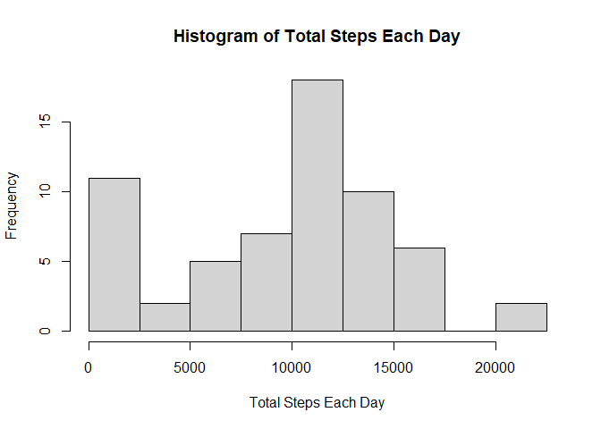
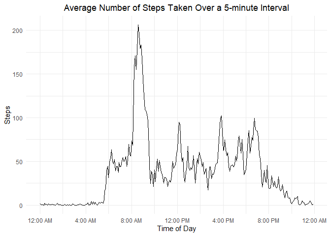
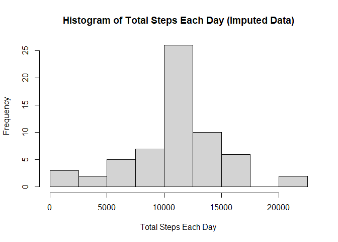
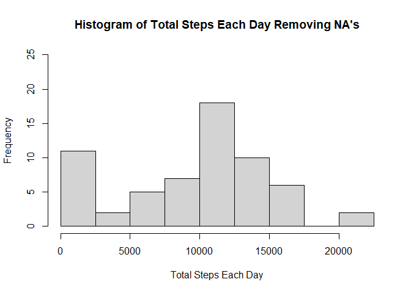
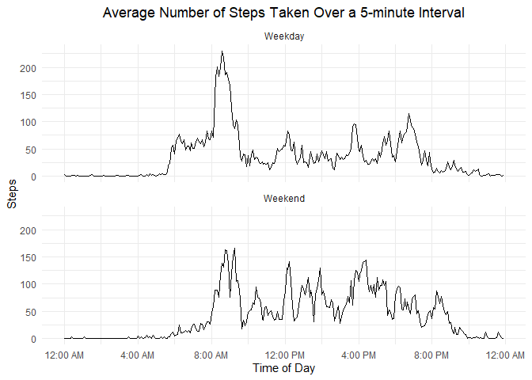

## Loading and preprocessing the data

The data was loaded into RStudio version 1.4.1106. After downloading the data into the working directory, the data was read in and assigned to the data frame "activity" by using the following code:


```r
activity <- read.csv("activity.csv")
head(activity)
```

```
##   steps       date interval
## 1    NA 2012-10-01        0
## 2    NA 2012-10-01        5
## 3    NA 2012-10-01       10
## 4    NA 2012-10-01       15
## 5    NA 2012-10-01       20
## 6    NA 2012-10-01       25
```

The full contents of the data set are not printed for brevity. The data contains 17,568 observations of three variables:

* **steps** - an integer value of the number of steps taken during a 5 minute interval. Missing values are coded as "NA".
* **date** - a character value containing the date written in a YYYY-MM-DD format.
* **interval** - an integer value denoting which 5 minute interval the steps were taken during.

Before analyzing the data, a new column will be created: calendardate. The calendardate column will contain the date as the POSIXct class. Having the date in a format that R recognizes will help during any manipulation.


```r
activity$calendardate <- as.POSIXct(activity$date)
head(activity$calendardate)
```

```
## [1] "2012-10-01 CDT" "2012-10-01 CDT" "2012-10-01 CDT" "2012-10-01 CDT"
## [5] "2012-10-01 CDT" "2012-10-01 CDT"
```

```r
class(activity$calendardate)
```

```
## [1] "POSIXct" "POSIXt"
```


## What is mean total number of steps taken per day?

To calculate the mean total number of steps taken per day, first the total number of steps taken each day must be calculated. This can be done using the tapply function:


```r
steptotals <- tapply(activity$steps, activity$date, sum, na.rm=TRUE)
print(steptotals)
```

```
## 2012-10-01 2012-10-02 2012-10-03 2012-10-04 2012-10-05 2012-10-06 2012-10-07 
##          0        126      11352      12116      13294      15420      11015 
## 2012-10-08 2012-10-09 2012-10-10 2012-10-11 2012-10-12 2012-10-13 2012-10-14 
##          0      12811       9900      10304      17382      12426      15098 
## 2012-10-15 2012-10-16 2012-10-17 2012-10-18 2012-10-19 2012-10-20 2012-10-21 
##      10139      15084      13452      10056      11829      10395       8821 
## 2012-10-22 2012-10-23 2012-10-24 2012-10-25 2012-10-26 2012-10-27 2012-10-28 
##      13460       8918       8355       2492       6778      10119      11458 
## 2012-10-29 2012-10-30 2012-10-31 2012-11-01 2012-11-02 2012-11-03 2012-11-04 
##       5018       9819      15414          0      10600      10571          0 
## 2012-11-05 2012-11-06 2012-11-07 2012-11-08 2012-11-09 2012-11-10 2012-11-11 
##      10439       8334      12883       3219          0          0      12608 
## 2012-11-12 2012-11-13 2012-11-14 2012-11-15 2012-11-16 2012-11-17 2012-11-18 
##      10765       7336          0         41       5441      14339      15110 
## 2012-11-19 2012-11-20 2012-11-21 2012-11-22 2012-11-23 2012-11-24 2012-11-25 
##       8841       4472      12787      20427      21194      14478      11834 
## 2012-11-26 2012-11-27 2012-11-28 2012-11-29 2012-11-30 
##      11162      13646      10183       7047          0
```

The total number of steps taken each day can be plotted as a histogram:


```r
hist(steptotals, xlab = "Total Steps Each Day", main = "Histogram of Total Steps Each Day", breaks = c(0, 2500, 5000, 7500, 10000, 12500, 15000, 17500, 20000, 22500))
```

<!-- -->

The code chunk contains label options for the x-axis, as well as the main title of the graph. The default label for the y-axis is used ("Frequency"). Also, the break points were specified.

Using the information in the steptotals variable, both the mean and median can be calculated, removing any missing values. The mean value of the total steps taken in a day is computed with:


```r
mean(steptotals, na.rm = TRUE)
```

```
## [1] 9354.23
```

The median value of total steps taken in a day can be computed with:


```r
median(steptotals, na.rm = TRUE)
```

```
## [1] 10395
```

## What is the average daily activity pattern?

To determine what the average daily activity pattern is, the intervalsteps data frame is created where the first column (intervals) is the 5 minute interval taken from the activity data frame. The steps column of the intervalsteps data frame is the average number of steps for that 5 minute interval averaged across all the days of the activity data frame. Any missing values are removed in the calculation. The code chunk to generate the intervalsteps data frame is here:


```r
intervalsteps <- data.frame(cbind(interval=unique(activity$interval), steps=tapply(activity$steps, activity$interval, mean, na.rm=TRUE)))
head(intervalsteps)
```

```
##    interval     steps
## 0         0 1.7169811
## 5         5 0.3396226
## 10       10 0.1320755
## 15       15 0.1509434
## 20       20 0.0754717
## 25       25 2.0943396
```

To more easily graph the daily activity pattern, the interval integer is converted to the hms class in the hms package. The conversion requires a few steps, however. First, the interval integer is formatted so there are four numbers to each value by adding leading zeroes to the minute integer (if needed). The four digits are then formatted into the HH:MM convention, which is then changed into the POSIXct class. Although the current date is added in this class, it is stripped back out of the hms class. Before converting to the hms class, the hms package needs to be called. The following code chunk accomplishes all of these transformations: 


```r
## Format interval as a four digit number and assign it to the time column
intervalsteps$time <- sprintf("%04d", unique(activity$interval))
head(intervalsteps$time)
```

```
## [1] "0000" "0005" "0010" "0015" "0020" "0025"
```

```r
## Add a colon to format into the HH:MM convention
intervalsteps$time <- format(strptime(intervalsteps$time, format="%H%M"), format = "%H:%M")
head(intervalsteps$time)
```

```
## [1] "00:00" "00:05" "00:10" "00:15" "00:20" "00:25"
```

```r
## Convert to POSIXct class
intervalsteps$timeposix <- as.POSIXct(intervalsteps$time, format = "%H:%M")
head(intervalsteps)
```

```
##    interval     steps  time           timeposix
## 0         0 1.7169811 00:00 2021-07-16 00:00:00
## 5         5 0.3396226 00:05 2021-07-16 00:05:00
## 10       10 0.1320755 00:10 2021-07-16 00:10:00
## 15       15 0.1509434 00:15 2021-07-16 00:15:00
## 20       20 0.0754717 00:20 2021-07-16 00:20:00
## 25       25 2.0943396 00:25 2021-07-16 00:25:00
```

```r
library(hms)
```

```r
intervalsteps$hms <- as_hms(intervalsteps$timeposix)
class(intervalsteps$hms)
```

```
## [1] "hms"      "difftime"
```

```r
head(intervalsteps)
```

```
##    interval     steps  time           timeposix      hms
## 0         0 1.7169811 00:00 2021-07-16 00:00:00 00:00:00
## 5         5 0.3396226 00:05 2021-07-16 00:05:00 00:05:00
## 10       10 0.1320755 00:10 2021-07-16 00:10:00 00:10:00
## 15       15 0.1509434 00:15 2021-07-16 00:15:00 00:15:00
## 20       20 0.0754717 00:20 2021-07-16 00:20:00 00:20:00
## 25       25 2.0943396 00:25 2021-07-16 00:25:00 00:25:00
```

This information is then graphed in the package ggplot2 to better visualize any activity patterns:


```r
library(ggplot2)
```

```r
ggplot(intervalsteps, aes(hms, steps)) + geom_line() + theme_minimal() + theme(plot.title = element_text(hjust = 0.5)) + labs(title = "Average Number of Steps Taken Over a 5-minute Interval", x = "Time of Day", y = "Steps") + scale_x_time(breaks=c(0, 14400, 28800, 43200, 57600, 72000, 86400), labels=c("12:00 AM", "4:00 AM", "8:00 AM", "12:00 PM", "4:00 PM", "8:00 PM", "12:00 AM"))
```

<!-- -->

Visually looking at the graph indicates that there is a sharp peak in steps shortly after 8:00 AM, with the maximum steps occurring approximately around 8:30 AM. To find the precise 5 minute interval of the maximum average steps taken over any given 5 minute interval, the following code can be used:


```r
intervalsteps[which.max(intervalsteps$steps), ]
```

```
##     interval    steps  time           timeposix      hms
## 835      835 206.1698 08:35 2021-07-16 08:35:00 08:35:00
```

The output is consistent with the graph. The maximum average number of steps taken over any given 5 minute interval occurs at 8:35 AM.

## Imputing missing values

All of the above calculations and graphs ignore the presence of missing values. To determine how many rows of data contain missing values, the following code is run:


```r
sum(is.na(activity$steps))
```

```
## [1] 2304
```

The output for this data set is 2304 rows that contain missing step data, which is approximately 13% of the data.

Before imputing any data, a copy of the activity data set is made:


```r
imputed.activity <- activity
head(imputed.activity)
```

```
##   steps       date interval calendardate
## 1    NA 2012-10-01        0   2012-10-01
## 2    NA 2012-10-01        5   2012-10-01
## 3    NA 2012-10-01       10   2012-10-01
## 4    NA 2012-10-01       15   2012-10-01
## 5    NA 2012-10-01       20   2012-10-01
## 6    NA 2012-10-01       25   2012-10-01
```

To impute the data, a vector is created with the indices of the missing values (called use.index). Another vector is created that matches the interval of the use.index with the interval in intervalsteps (called NA.value.index). Next, a vector of the means of the matching intervals is created (called replace.value). Finally, the missing step values at the positions indicated in the use.index vector are replaced by the means of the steps in the replace.value vector. All of this code is shown below. A portion of each vector is displayed for clarity, along with the final imputed.activity data set.


```r
## Find which indices of imputed.activity$steps are missing values
use.index <- which(is.na(imputed.activity$steps))
head(use.index, n=20)
```

```
##  [1]  1  2  3  4  5  6  7  8  9 10 11 12 13 14 15 16 17 18 19 20
```

```r
## Match the interval of the missing step data with the interval in the intervalsteps data frame
NA.value.index <- match(imputed.activity$interval[use.index], intervalsteps$interval)
head(NA.value.index, n=20)
```

```
##  [1]  1  2  3  4  5  6  7  8  9 10 11 12 13 14 15 16 17 18 19 20
```

```r
## For each interval index in intervalsteps, create a vector of corresponding average steps
replace.value <- intervalsteps$steps[NA.value.index]
head(replace.value, n=20)
```

```
##  [1] 1.7169811 0.3396226 0.1320755 0.1509434 0.0754717 2.0943396 0.5283019
##  [8] 0.8679245 0.0000000 1.4716981 0.3018868 0.1320755 0.3207547 0.6792453
## [15] 0.1509434 0.3396226 0.0000000 1.1132075 1.8301887 0.1698113
```

```r
## Replace the missing values with the looked up average of steps for that interval
imputed.activity$steps[use.index] <- replace.value
head(imputed.activity$steps[use.index], n=20)
```

```
##  [1] 1.7169811 0.3396226 0.1320755 0.1509434 0.0754717 2.0943396 0.5283019
##  [8] 0.8679245 0.0000000 1.4716981 0.3018868 0.1320755 0.3207547 0.6792453
## [15] 0.1509434 0.3396226 0.0000000 1.1132075 1.8301887 0.1698113
```

```r
## View the imputed activity data set
head(imputed.activity, n=20)
```

```
##        steps       date interval calendardate
## 1  1.7169811 2012-10-01        0   2012-10-01
## 2  0.3396226 2012-10-01        5   2012-10-01
## 3  0.1320755 2012-10-01       10   2012-10-01
## 4  0.1509434 2012-10-01       15   2012-10-01
## 5  0.0754717 2012-10-01       20   2012-10-01
## 6  2.0943396 2012-10-01       25   2012-10-01
## 7  0.5283019 2012-10-01       30   2012-10-01
## 8  0.8679245 2012-10-01       35   2012-10-01
## 9  0.0000000 2012-10-01       40   2012-10-01
## 10 1.4716981 2012-10-01       45   2012-10-01
## 11 0.3018868 2012-10-01       50   2012-10-01
## 12 0.1320755 2012-10-01       55   2012-10-01
## 13 0.3207547 2012-10-01      100   2012-10-01
## 14 0.6792453 2012-10-01      105   2012-10-01
## 15 0.1509434 2012-10-01      110   2012-10-01
## 16 0.3396226 2012-10-01      115   2012-10-01
## 17 0.0000000 2012-10-01      120   2012-10-01
## 18 1.1132075 2012-10-01      125   2012-10-01
## 19 1.8301887 2012-10-01      130   2012-10-01
## 20 0.1698113 2012-10-01      135   2012-10-01
```

An imputed.steptotals is created to aid in analyzing the total steps in a day using imputed data.


```r
imputed.steptotals <- tapply(imputed.activity$steps, imputed.activity$date, sum)
print(imputed.steptotals)
```

```
## 2012-10-01 2012-10-02 2012-10-03 2012-10-04 2012-10-05 2012-10-06 2012-10-07 
##   10766.19     126.00   11352.00   12116.00   13294.00   15420.00   11015.00 
## 2012-10-08 2012-10-09 2012-10-10 2012-10-11 2012-10-12 2012-10-13 2012-10-14 
##   10766.19   12811.00    9900.00   10304.00   17382.00   12426.00   15098.00 
## 2012-10-15 2012-10-16 2012-10-17 2012-10-18 2012-10-19 2012-10-20 2012-10-21 
##   10139.00   15084.00   13452.00   10056.00   11829.00   10395.00    8821.00 
## 2012-10-22 2012-10-23 2012-10-24 2012-10-25 2012-10-26 2012-10-27 2012-10-28 
##   13460.00    8918.00    8355.00    2492.00    6778.00   10119.00   11458.00 
## 2012-10-29 2012-10-30 2012-10-31 2012-11-01 2012-11-02 2012-11-03 2012-11-04 
##    5018.00    9819.00   15414.00   10766.19   10600.00   10571.00   10766.19 
## 2012-11-05 2012-11-06 2012-11-07 2012-11-08 2012-11-09 2012-11-10 2012-11-11 
##   10439.00    8334.00   12883.00    3219.00   10766.19   10766.19   12608.00 
## 2012-11-12 2012-11-13 2012-11-14 2012-11-15 2012-11-16 2012-11-17 2012-11-18 
##   10765.00    7336.00   10766.19      41.00    5441.00   14339.00   15110.00 
## 2012-11-19 2012-11-20 2012-11-21 2012-11-22 2012-11-23 2012-11-24 2012-11-25 
##    8841.00    4472.00   12787.00   20427.00   21194.00   14478.00   11834.00 
## 2012-11-26 2012-11-27 2012-11-28 2012-11-29 2012-11-30 
##   11162.00   13646.00   10183.00    7047.00   10766.19
```

From this data, the mean and median of the two data sets can be compared:


```r
mean(steptotals, na.rm = TRUE)
```

```
## [1] 9354.23
```

```r
mean(imputed.steptotals)
```

```
## [1] 10766.19
```

```r
median(steptotals, na.rm = TRUE)
```

```
## [1] 10395
```

```r
median(imputed.steptotals)
```

```
## [1] 10766.19
```

The updated histogram using the imputed data set can be compared to the original data set (below, with missing values removed):


```r
hist(imputed.steptotals, xlab = "Total Steps Each Day", main = "Histogram of Total Steps Each Day (Imputed Data)", breaks = c(0, 2500, 5000, 7500, 10000, 12500, 15000, 17500, 20000, 22500))
```

<!-- -->

```r
hist(steptotals, xlab = "Total Steps Each Day", main = "Histogram of Total Steps Each Day Removing NA's", breaks = c(0, 2500, 5000, 7500, 10000, 12500, 15000, 17500, 20000, 22500), ylim=c(0, 25))
```

<!-- -->

As expected, the histogram of the imputed data shows fewer days with very few steps (0-2500 steps) and more days that fall at the mean (10000-12500 steps). The mean and median of the imputed data also reflects that the missing data was filled in with mean values, resulting in a mean and median that are identical.

## Are there differences in activity patterns between weekdays and weekends?

To determine whether there are differences in activity patterns between weekdays and weekends, first a column is created in the imputedactivity data set that takes the date and determines what day of the week it is.


```r
imputed.activity$day <- weekdays(imputed.activity$calendardate)
head(imputed.activity$day)
```

```
## [1] "Monday" "Monday" "Monday" "Monday" "Monday" "Monday"
```

Since we only need to know whether a day is a "weekday" or a "weekend" day, any day that is "Sunday" or "Saturday" is substituted as a "Weekend" day, and the other days are all substituted as "Weekday" days.


```r
imputed.activity$day <- sub("Monday", "Weekday", imputed.activity$day)
imputed.activity$day <- sub("Tuesday", "Weekday", imputed.activity$day)
imputed.activity$day <- sub("Wednesday", "Weekday", imputed.activity$day)
imputed.activity$day <- sub("Thursday", "Weekday", imputed.activity$day)
imputed.activity$day <- sub("Friday", "Weekday", imputed.activity$day)
imputed.activity$day <- sub("Saturday", "Weekend", imputed.activity$day)
imputed.activity$day <- sub("Sunday", "Weekend", imputed.activity$day)
head(imputed.activity$day)
```

```
## [1] "Weekday" "Weekday" "Weekday" "Weekday" "Weekday" "Weekday"
```

Finally, the imputed.activity$day column is converted to a factor variable:


```r
imputed.activity$day <- as.factor(imputed.activity$day)
head(imputed.activity$day)
```

```
## [1] Weekday Weekday Weekday Weekday Weekday Weekday
## Levels: Weekday Weekend
```

A new data frame (dayofweeksteps) is created by calling the aggregate function to calculate the mean number of steps for each 5 minute interval separately for weekdays and weekend days. The code chunk and result are below:


```r
dayofweeksteps <- aggregate(imputed.activity$steps, list(imputed.activity$interval, imputed.activity$day), mean)
head(dayofweeksteps)
```

```
##   Group.1 Group.2          x
## 1       0 Weekday 2.25115304
## 2       5 Weekday 0.44528302
## 3      10 Weekday 0.17316562
## 4      15 Weekday 0.19790356
## 5      20 Weekday 0.09895178
## 6      25 Weekday 1.59035639
```

The column names of dayofweeksteps are renamed to make the analysis easier to program:


```r
colnames(dayofweeksteps) <- c("interval", "day", "steps")
head(dayofweeksteps)
```

```
##   interval     day      steps
## 1        0 Weekday 2.25115304
## 2        5 Weekday 0.44528302
## 3       10 Weekday 0.17316562
## 4       15 Weekday 0.19790356
## 5       20 Weekday 0.09895178
## 6       25 Weekday 1.59035639
```

As with intervalsteps, the interval column is converted to a time class with the hms package:


```r
dayofweeksteps$time <- sprintf("%04d", dayofweeksteps$interval)
dayofweeksteps$time <- format(strptime(dayofweeksteps$time, format="%H%M"), format = "%H:%M")
dayofweeksteps$timeposix <- as.POSIXct(dayofweeksteps$time, format = "%H:%M")
head(dayofweeksteps)
```

```
##   interval     day      steps  time           timeposix
## 1        0 Weekday 2.25115304 00:00 2021-07-16 00:00:00
## 2        5 Weekday 0.44528302 00:05 2021-07-16 00:05:00
## 3       10 Weekday 0.17316562 00:10 2021-07-16 00:10:00
## 4       15 Weekday 0.19790356 00:15 2021-07-16 00:15:00
## 5       20 Weekday 0.09895178 00:20 2021-07-16 00:20:00
## 6       25 Weekday 1.59035639 00:25 2021-07-16 00:25:00
```


```r
dayofweeksteps$hms <- as_hms(dayofweeksteps$timeposix)
class(dayofweeksteps$hms)
```

```
## [1] "hms"      "difftime"
```

```r
head(dayofweeksteps)
```

```
##   interval     day      steps  time           timeposix      hms
## 1        0 Weekday 2.25115304 00:00 2021-07-16 00:00:00 00:00:00
## 2        5 Weekday 0.44528302 00:05 2021-07-16 00:05:00 00:05:00
## 3       10 Weekday 0.17316562 00:10 2021-07-16 00:10:00 00:10:00
## 4       15 Weekday 0.19790356 00:15 2021-07-16 00:15:00 00:15:00
## 5       20 Weekday 0.09895178 00:20 2021-07-16 00:20:00 00:20:00
## 6       25 Weekday 1.59035639 00:25 2021-07-16 00:25:00 00:25:00
```

With the data formatted in this way, ggplot2 can be used to create a panel plot. The average number of steps is plotted for each 5 minute interval, broken into two graphs: one for weekdays and one for weekend days.


```r
ggplot(dayofweeksteps, aes(hms, steps)) + geom_line() + theme_minimal() + theme(plot.title = element_text(hjust = 0.5)) + labs(title = "Average Number of Steps Taken Over a 5-minute Interval", x = "Time of Day", y = "Steps") + scale_x_time(breaks=c(0, 14400, 28800, 43200, 57600, 72000, 86400), labels=c("12:00 AM", "4:00 AM", "8:00 AM", "12:00 PM", "4:00 PM", "8:00 PM", "12:00 AM")) + facet_wrap(~day, ncol=1)
```

<!-- -->


